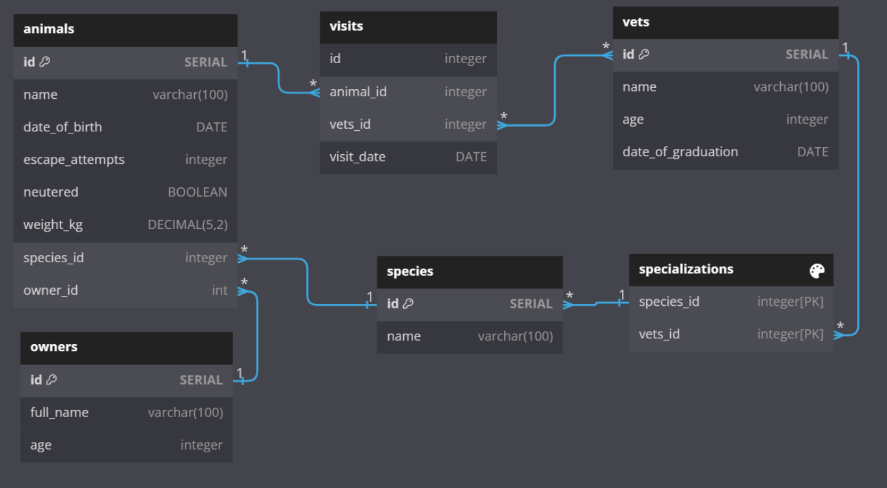

<a name="readme-top"></a>

<div align="center">
  
  <h3><b>Vet Clinic Database</b></h3>

</div>

# 📗 Table of Contents

- [📖 About the Project](#about-project)
  - [🛠 Built With](#built-with)
    - [Tech Stack](#tech-stack)
    - [Key Features](#key-features)
- [💻 Getting Started](#getting-started)
  - [Setup](#setup)
  - [Prerequisites](#prerequisites)
  - [Install](#install)
  - [Usage](#usage)
- [👥 Authors](#authors)
- [🔭 Future Features](#future-features)
- [🤝 Contributing](#contributing)
- [⭐️ Show your support](#support)
- [🙏 Acknowledgements](#acknowledgements)
- [📝 License](#license)

# 📖 [Vet Clinic Database] <a name="about-project"></a>

> Project about a Vet Clinic database

Database Diagram



## 🛠 Built With <a name="built-with"></a>

### Tech Stack <a name="tech-stack"></a>

<details>
  <summary>Client</summary>
  <ul>
    <li><a href="https://reactjs.org/">React.js</a></li>
  </ul>
</details>

<details>
  <summary>Server</summary>
  <ul>
    <li><a href="https://expressjs.com/">Express.js</a></li>
  </ul>
</details>

<details>
<summary>Database</summary>
  <ul>
    <li><a href="https://www.postgresql.org/">PostgreSQL</a></li>
  </ul>
</details>

### Key Features <a name="key-features"></a>

- **[Database built using PostgreSQL]**

<p align="right">(<a href="#readme-top">back to top</a>)</p>


## 💻 Getting Started <a name="getting-started"></a>

### Prerequisites

In order to run this project you need:

```sh
 gem install rails
```

-->

### Setup

Clone this repository to your desired folder:

```sh
  cd my-folder
  git clone https://github.com/PabloEGonz/vet-clinic-db.git
```

--->

### Install

Install this project with:

```sh
  cd my-project
  gem install
```

--->

### Usage

To run the project, execute the following command:

```sh
  rails server
```

--->

### Run tests

To run tests, run the following command:

```sh
  bin/rails test test/models/article_test.rb
```

--->

<p align="right">(<a href="#readme-top">back to top</a>)</p>

## 👥 Authors <a name="authors"></a>

👤 Pablo Gonzalez

- GitHub: [@PabloEGonz](https://github.com/PabloEGonz)
- Twitter: [@PabloEzGon](https://twitter.com/PabloEzGon)
- LinkedIn: [LinkedIn](https://www.linkedin.com/in/pablo-ezequiel-gonz%C3%A1lez-ramos-b9b854265)

<p align="right">(<a href="#readme-top">back to top</a>)</p>

## 🔭 Future Features <a name="future-features"></a>

- [ ] Adding more data to the animals table.

<p align="right">(<a href="#readme-top">back to top</a>)</p>

## 🤝 Contributing <a name="contributing"></a>

Contributions, issues, and feature requests are welcome!

Feel free to check the [issues page](../../issues/).

<p align="right">(<a href="#readme-top">back to top</a>)</p>


## ⭐️ Show your support <a name="support"></a>

If you like this project, please give it a start.

<p align="right">(<a href="#readme-top">back to top</a>)</p>

## 🙏 Acknowledgments <a name="acknowledgements"></a>

This project is an assigment from Microverse.

<p align="right">(<a href="#readme-top">back to top</a>)</p>

## 📝 License <a name="license"></a>

This project is [MIT](./LICENSE) licensed.

<p align="right">(<a href="#readme-top">back to top</a>)</p>
